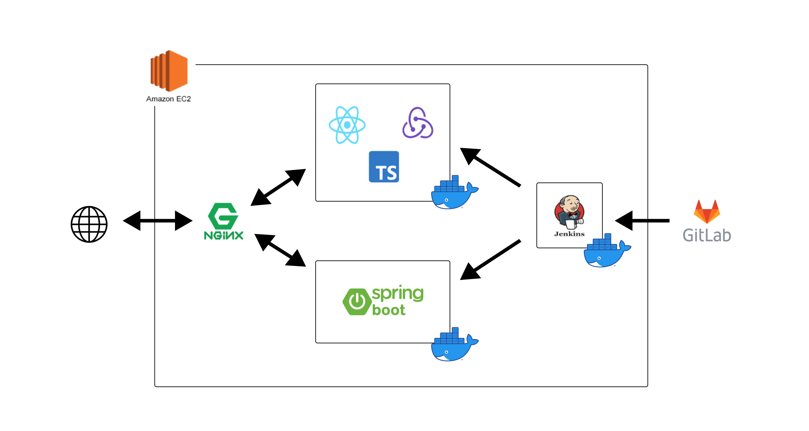

---
---

<h1 align="center">
  Prologue
</h1>


프롤로그는 많은 사용자들이 깃허브 블로그를 쉽게 이용할 수 있도록 도와주는 솔루션 서비스입니다.

# **주요기능**

- 기존의 CLI 환경에서 작업하던 번거로운 작업을 GUI를 통해 편리하게 이용할 수 있도록 개발하였습니다.
- Git Actions를 활용해 변경사항을 인식하고 자동으로 빌드-배포할 수 있습니다.
- 오픈소스 테마를 활용해 다양한 테마를 지원하고 프로젝트를 확장시킬 수 있습니다.

# **세부기능**

- **블로그**

  - 블로그 생성
  - 블로그 설정
  - 블로그 배포

- **게시글**

  - 게시글 목록
  - 게시글 작성
  - 게시글 수정
  - 게시글 삭제

- **레이아웃**

  - 레이아웃 구조 설정
  - 레이아웃 상세 설정

# 프로젝트 빌드 방법

BackEnd

```
git clone  <repo URL>
cd backend/prologue
./gradlew
cd build/libs ssafy-web-project-1.0-SNAPSHOT.jar
```

FrontEnd

```
git clone  <repo URL>
cd frontend
npm install
npm start
```

# 개발자

- [BE] 윤석찬 (82chain@gmail.com)
- [BE] 권유나 (yunaghgh@gmail.com)
- [BE] 김태훈 (com151925@gmail.com)
- [FE] 강정현 (jhkang9820@gmail.com)
- [FE] 김주연 (dustn4325@gmail.com)
- [FE] 김연수 (jyeon3930@gmail.com)

# 아키텍처



# 커뮤니티 가이드

[Prologue document page](https://prologue-docs.site/docs/template/get-started/introduction)

- [행동강령](../community-guide/contributorCovenant)
- [기여 가이드](../community-guide/contributionGuide)
- [기여 컨벤션](../community-guide/contributionConvention)

# License

- [MIT License](../community-guide/license)
