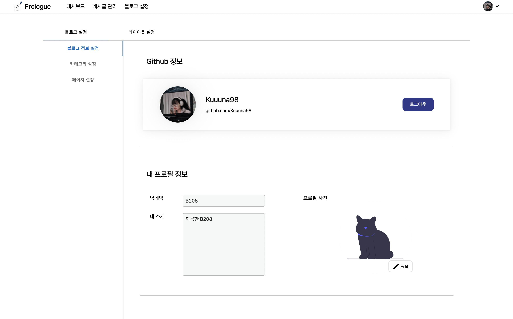
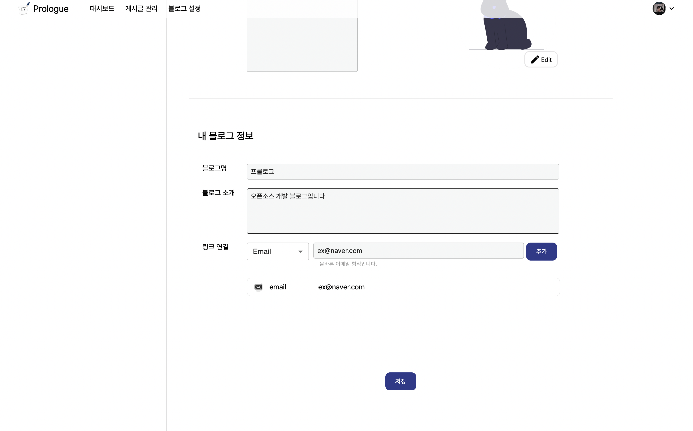
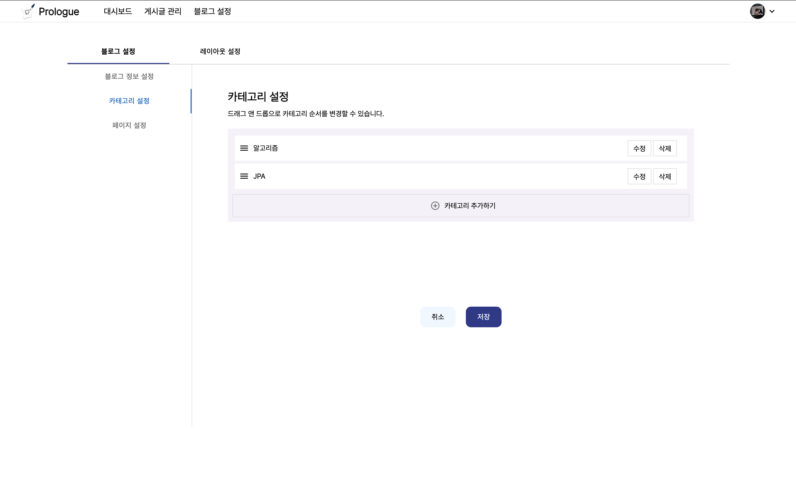
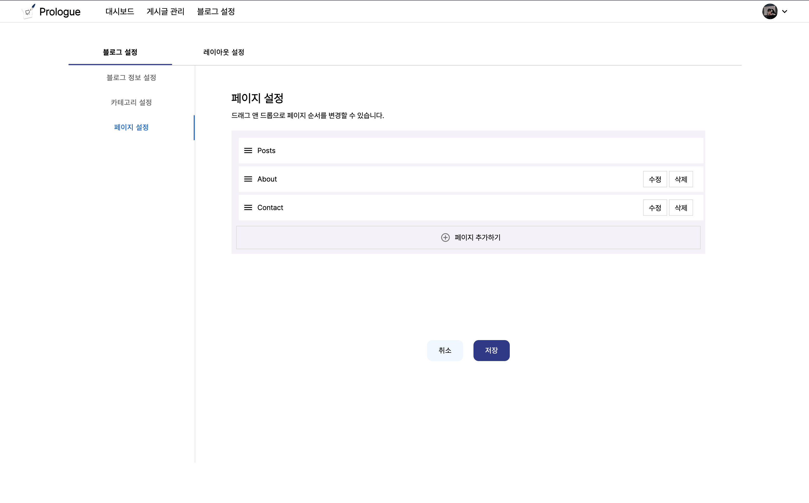

---
---

<h1 align="center">
  블로그 설정
</h1>

## 1. 프로필 설정

- 프로필 사진을 변경할 수 있습니다.
- 프로필 닉네임을 변경할 수 있습니다.
  

## 2. 블로그 정보 설정

- 블로그 명을 변경할 수 있습니다.
- 블로그 소개를 변경할 수 있습니다.
  

## 3. 카테고리 설정

- 카테고리를 추가, 수정, 삭제할 수 있습니다.
- 드래그 앤 드랍으로 자유롭게 순서를 변경할 수 있습니다.
  

## 4. 페이지 설정

