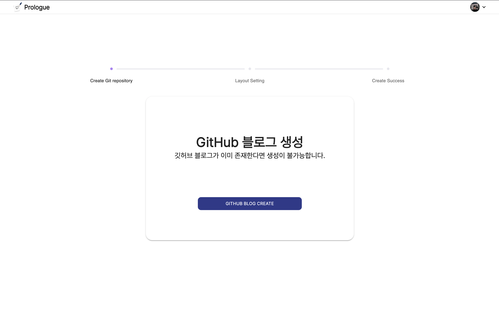

---
---

# **블로그 생성**

## 1. 레포지토리 조회

- 깃허브 로그인 후 사용자 레포지토리에 이미 생성된 블로그가 있는지 확인합니다.
- 생성된 블로그가 없는 경우 블로그 생성 페이지로 이동합니다.

## 2. 레이아웃 선택

- 직접 레이아웃 셋팅
  
- Gatsby 제공 레이아웃
  

## 3. 블로그 기본 정보 입력

- 블로그 기본 정보 입력

## 4. 블로그 생성 완료

- 블로그 생성 완료 페이지
