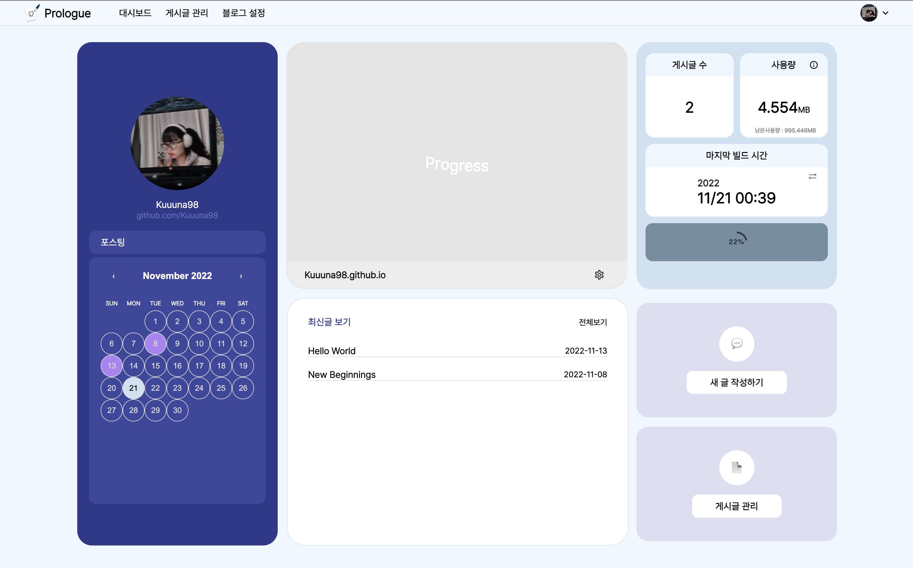

---
---

<h1 align="center">
  대시보드
</h1>

## 1. 달력

- 달력을 통해 사용자가 해당 월에 작성한 게시글을 확인할 수 있습니다.

## 2. 블로그 바로가기

- 블로그 바로가기를 통해 사용자가 운영하는 깃허브 블로그로 이동할 수 있습니다.

## 3. 전체 게시글 수

- 전체 게시글 수를 통해 사용자 블로그 전체 게시글 수를 파악할 수 있습니다.

## 4. 레포지토리 사용량

- 사용자 깃허브 블로그 레포지토리의 사용량을 확인할 수 있습니다.
- 깃허브 블로그 레포지토리 사용량은 총 1GB로 제한됩니다.

## 5. 최근 빌드 시간

- 사용자 블로그의 최근 빌드시간을 확인할 수 있습니다.

## 6. 배포 버튼

- 배포버튼을 통해 사용자 레포지토에 변경사항을 빌드-배포 할 수 있습니다.
- 변경사항이 존재하지 않으면 해당 버튼은 비활성화 됩니다.

## 7. 게시글 목록

- 게시글 목록 버튼을 통해 사용자 게시글 목록 페이지로 이동할 수 있습니다.

## 8. 블로그 설정

- 블로그 설정 버턴을 통해 블로그 설정 페이지로 이동할 수 있습니다.
