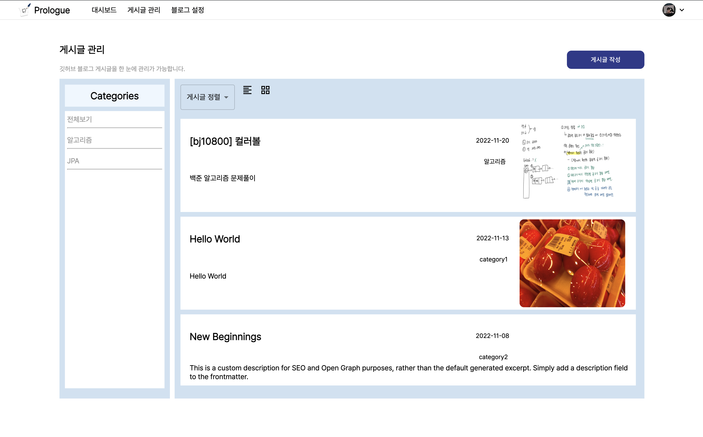
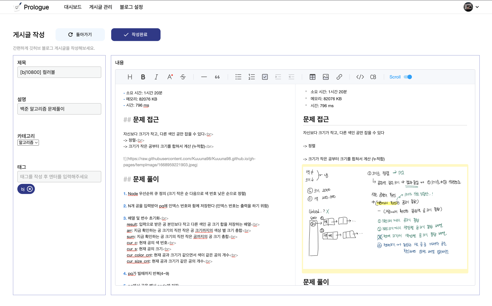
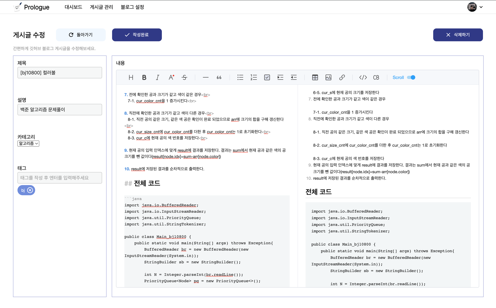

---
---

<h1 align="center">
  게시글 관리
</h1>

## 1. 게시글 목록

- 게시글 목록을 확인할 수 있습니다.
- 카테고리 클릭 시 해당 카테고리에 해당하는 게시글 목록을 확인할 수 있습니다.
  

## 2. 게시글 작성

- 게시글 작성이 가능합니다.
- 게시글 제목과 설명은 필수로 작성해야 합니다.
- 이미지 업로드시 사용자 깃허브 레포지토리에 자동으로 업로드 됩니다.
- 

## 3. 게시글 조회 / 수정 / 삭제

- 게시글 조회, 수정, 삭제를 자유롭게 할 수 있습니다.
  
